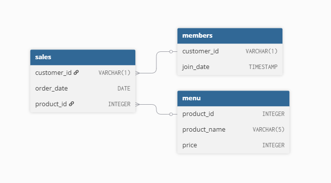

# 🍜 Danny's Diner - 8 Week SQL Challenge (Case Study #1)

This repository contains my solutions and SQL analysis for the **Danny's Diner** case study from the [8 Week SQL Challenge](https://8weeksqlchallenge.com/case-study-1/).

## 📚 Case Study Summary

Danny wants to use data to better understand his customers and their visiting patterns. The case study focuses on analyzing sales, menu items, and customer behavior using SQL.

## 🗂️ Files in This Repository

- `schema.sql` → SQL script to create the tables
- `data_inserts.sql` → SQL script to populate the data
- `solutions/` → Folder with one SQL file per question
- `insights.md` → Optional analysis notes (in Markdown)

## 🧩 Entity Relationship Diagram

## 🛠️ Tools

- SQL (PostgreSQL)
- VS Code / DB Browser / pgAdmin

## 📈 Topics Covered

- JOINs
- Aggregations
- Ranking
- Window functions
- Customer behavior analysis

## ✅ Source

[8 Week SQL Challenge – Case Study #1](https://8weeksqlchallenge.com/case-study-1/)
